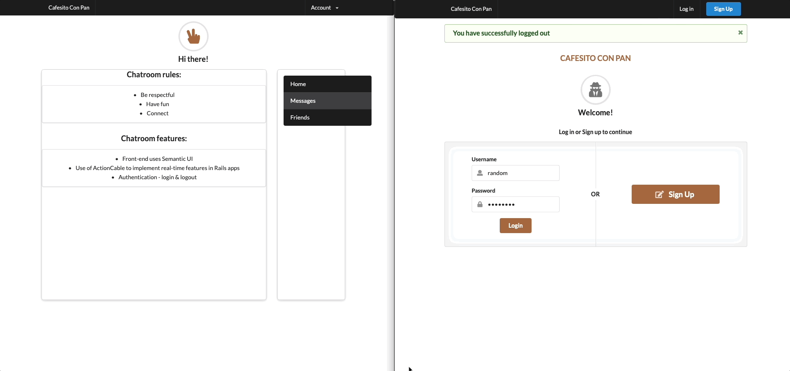

# Cafesito Con Pan

### Description
A web-based chat interface that uses the Rails 7 framework for server-side processing and the Semantics UI library for creating the user interface. This chatbox allows users to send and receive messages in real-time

### Dependecies
* Ruby version: 3.0.0
* Rails version: 7.0.4.2

### Steps necessary to get the application up and running locally

> Make sure you have Ruby and Rails installed on your local machine. You can check this by running `ruby -v` and `rails -v` in your terminal.

1. Clone this repository

2. Navigate to the app's directory in your terminal using the cd command

3. Run `bundle install` to install all the app's dependencies

4. Create the app's database by running `rails db:create` in your terminal

5. Populate database with seed information by runnin `rails db:seed` in your terminal

6. Migrate the database schema by running rails `db:migrate` in your terminal

7. Start the Rails server by running `rails server` or `rails s` in your terminal

8. Open your web browser and navigate to `http://localhost:3000`, where you should see the app's home page.

### Demo
